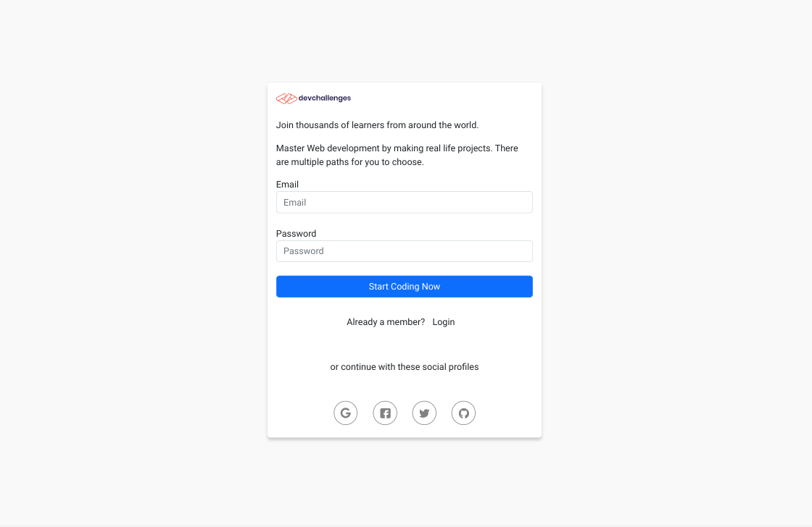
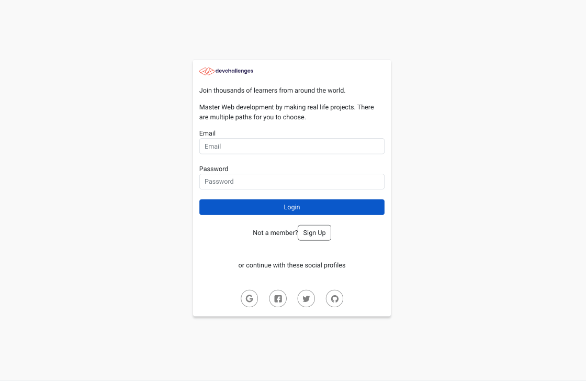
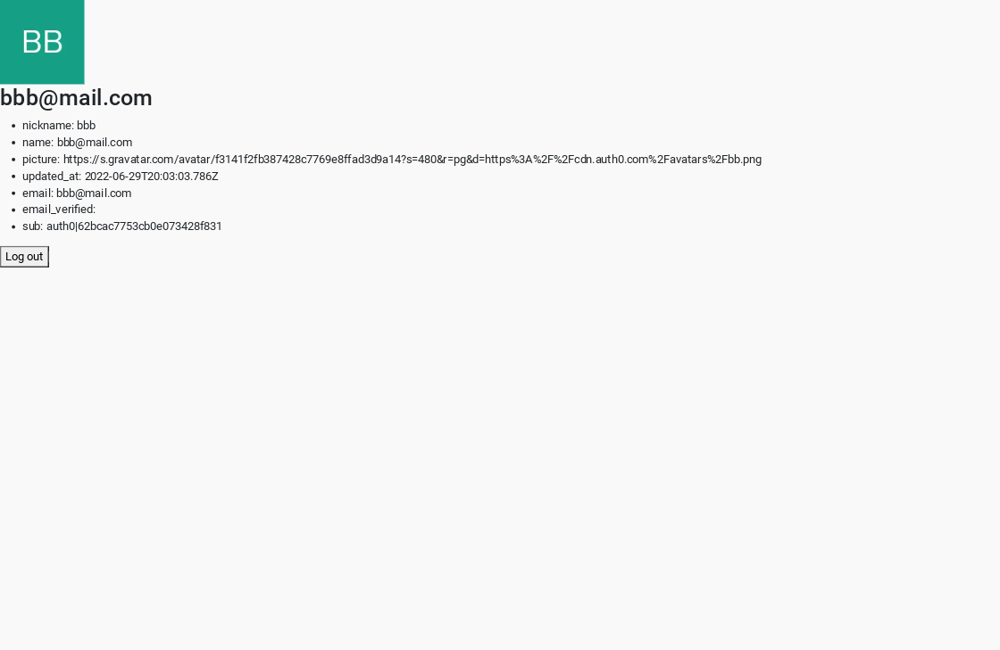

<h1 align="center">Devchallenges Auth0 Auth App</h1>

   Solution for a challenge from  <a href="https://devchallenges.io/challenges/N1fvBjQfhlkctmwj1tnw" target="_blank">Devchallenges.io</a>.

## Table of Contents

- [Overview](#overview)
  - [Built With](#built-with)
- [Features](#features)
- [Useful Resources](#useful-resources)

## Overview

I tried to translate the devchallenges design to work with auth0. I modified the custom login template code provided by Auth0.  That code used bootstrap so I used that as well.  src/CustomLogin.html is the code that I added to Auth0 for the custom login page.  I had some issues on getting the social logins to work but you have to make sure the connection property matches the login's name property set in the Auth0 dashboard. I found it confusing to know if the custom login page persists across all your auth0 applications or if you can make custom logins per application.  I think there is a dropdown to select the application but the site gives no feedback on selection.

Made it so, you see loading and then the form is fetched from auth0.  Used router and conditional rendering for the routes.  

Instead of the separate login and signup forms, I used a toggle to switch buttons for each purpose.  

Have to have 3rd party cookies enabled otherwise you will see a auth0 error screen.    

Need to look at styling for mobile and tablet versions.  

### Built With

- [Create React App](https://github.com/facebook/create-react-app)
- [React](https://reactjs.org)
- [Auth0](https://auth0.com)
- [Bootstrap](https://getbootstrap.com)

## Features

This application/site was created as a submission to a [DevChallenges](https://devchallenges.io/challenges) challenge. The [challenge](https://devchallenges.io/challenges/N1fvBjQfhlkctmwj1tnw) was to build an application to complete the given user stories.

## Useful Resources

- [Steps to replicate a design with only HTML and CSS](https://devchallenges-blogs.web.app/how-to-replicate-design/)
- [YouTube](https://www.youtube.com/watch?v=pAzqscDx580&list=PL0Zuz27SZ-6PRCpm9clX0WiBEMB70FWwd&index=8) - Auth0 & React Tutorial from Dave Gray - reused Profile code 
- [Stack Exchange](https://ux.stackexchange.com/questions/11840/best-way-to-combine-sign-in-and-sign-up-in-the-same-form) - best way to combine sign up & login
- [Codepen](https://codepen.io/ehermanson/pen/KwKWEv) - login / signup form with tabs
- [Stack Overflow](https://stackoverflow.com/questions/53539461/how-do-i-use-vanilla-javascript-to-write-a-toggle-function-i-wrote-in-jquery) - toggle function in vanilla js
- [Stack Overflow](https://stackoverflow.com/questions/48497510/simple-conditional-routing-in-reactjs) - conditional routing
